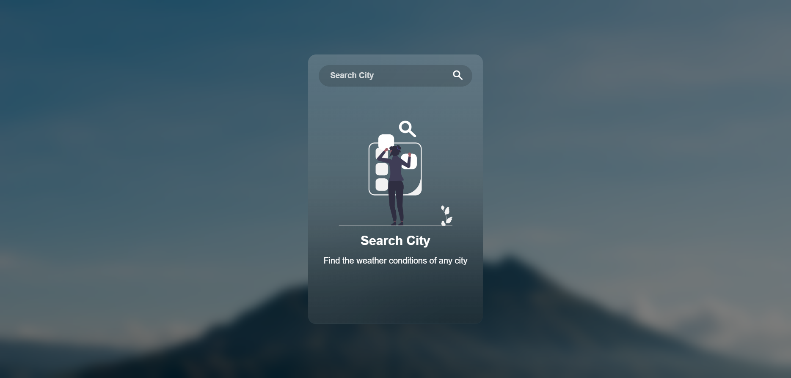
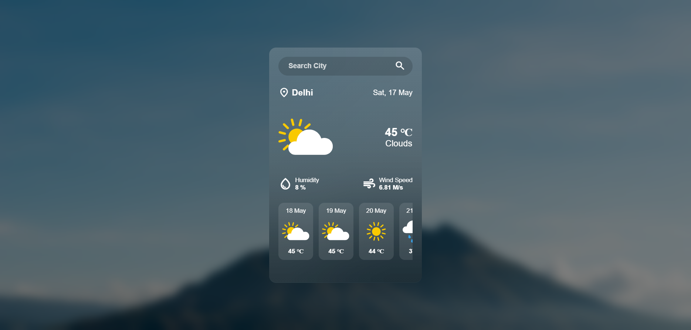
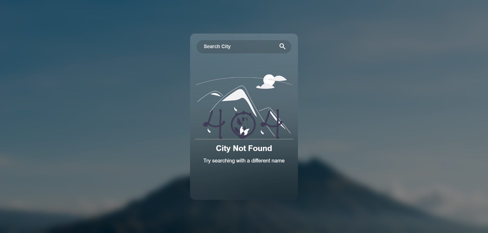

# 🌦️ Weather App

A responsive and modern weather application built using **HTML**, **CSS**, and **JavaScript** that shows real-time weather conditions and a 4-day forecast using the **OpenWeatherMap API**.

---

## 📌 Features

- 🌍 Real-time weather updates by city name
- 📅 4-day forecast with icons and temperature
- 🚫 Error handling for invalid city inputs
- 🎨 Stylish UI with Google Fonts and custom icons

---

## 🚀 Tech Stack

- **HTML5**
- **CSS3**
- **JavaScript (ES6)**
- **Google Fonts**
- **OpenWeatherMap API**

---

## 📸 Screenshots

### 🔍 Search a City


### ✅ Weather Results


### ❌ City Not Found



---

## 👨‍💻 Author

Created by [Aryan Das](https://github.com/aryandas2911)

---

### 📁 Clone the Repository

1. **Clone the repository**:
    ```bash
      git clone https://github.com/aryandas2911/Weather-App.git
      cd Weather-App
2. Open index.html in your preferred browser

---

## 🤝 Contributing

Pull requests are welcome! Feel free to fork the repo and submit improvements or additional features.

